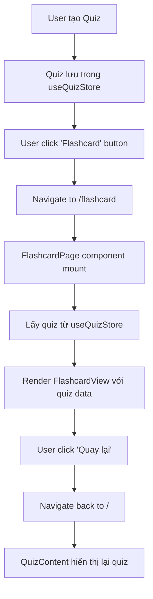

# Kế Hoạch Triển Khai: Flashcard Như Một Route Riêng Biệt

## 🎯 Mục tiêu

Chuyển FlashcardView từ conditional render trong QuizContent thành một route độc lập với URL riêng.

## 📊 So sánh Kiến trúc

### Hiện tại (Before)

```
URL: /
├─ Index Page
    └─ QuizContent
        └─ if (showFlashcard) → FlashcardView (conditional)
```

### Sau khi refactor (After)

```
URL: /
├─ Index Page
    └─ QuizContent (không có flashcard)

URL: /flashcard
├─ Flashcard Page (route riêng)
    └─ FlashcardView
```

## ✅ Lợi ích

1. **Better Navigation**: URL thay đổi rõ ràng, browser back/forward hoạt động tự nhiên
2. **Shareable Links**: User có thể share link flashcard trực tiếp
3. **Cleaner Architecture**: Tách biệt concerns, dễ maintain
4. **Better UX**: Flashcard có địa chỉ riêng, dễ bookmark
5. **Fixes Navigation Bug**: Không còn vấn đề flashcard che phủ các trang khác

## 🏗️ Kiến trúc chi tiết

### 1. Route Structure

```typescript
// App.tsx routes
<Routes>
  <Route path="/" element={<Index />} />
  <Route path="/about" element={<About />} />
  <Route path="/library" element={<QuizLibrary />} />
  <Route path="/dashboard" element={<Dashboard />} />
  <Route path="/flashcard" element={<FlashcardPage />} /> {/* NEW */}
  <Route path="*" element={<NotFound />} />
</Routes>
```

### 2. State Management Flow



### 3. Data Flow

```
useQuizStore (Zustand + LocalStorage Persist)
    ↓
    ├─ Index Page (/): QuizContent đọc quiz
    └─ Flashcard Page (/flashcard): FlashcardView đọc quiz

Cả hai components đọc từ cùng store → Data sync tự động
```

## 📝 Implementation Steps

### STEP 1: Tạo FlashcardPage Component

**File mới**: `src/pages/FlashcardPage.tsx`

```tsx
import { useEffect } from "react";
import { useNavigate } from "react-router-dom";
import { useQuizStore } from "@/hooks/useQuizStore";
import FlashcardView from "@/components/flashcard/FlashcardView";
import Navbar from "@/components/layout/Navbar";
import SeoMeta from "@/components/SeoMeta";

const FlashcardPage = () => {
  const navigate = useNavigate();
  const quiz = useQuizStore((state) => state.quiz);

  // Redirect nếu không có quiz
  useEffect(() => {
    if (!quiz) {
      navigate("/", { replace: true });
    }
  }, [quiz, navigate]);

  // Không render nếu không có quiz
  if (!quiz) {
    return null;
  }

  const handleBack = () => {
    navigate("/", { state: { scrollToQuiz: true } });
  };

  return (
    <>
      <SeoMeta
        title={`Flashcard - ${quiz.title} | QuizKen`}
        description={`Học với flashcard: ${quiz.description || quiz.title}`}
        canonical="/flashcard"
        noindex={true} // Không index trang flashcard vì nội dung dynamic
      />
      <Navbar />
      <FlashcardView quiz={quiz} onBack={handleBack} />
    </>
  );
};

export default FlashcardPage;
```

**Key Points**:

- ✅ Check quiz tồn tại, redirect về home nếu không
- ✅ Lấy quiz từ useQuizStore (persist)
- ✅ Handle back navigation về Index với scroll to quiz
- ✅ Include Navbar để user vẫn navigate được
- ✅ SEO meta với noindex (dynamic content)

### STEP 2: Update App.tsx - Thêm Route

**File**: `src/App.tsx`

```tsx
// Thêm import
const FlashcardPage = lazy(() => import("./pages/FlashcardPage"));

// Trong AnimatedRoutes component
<Routes location={location} key={location.pathname}>
  <Route path="/" element={<Index />} />
  <Route path="/about" element={<About />} />
  <Route path="/library" element={<QuizLibrary />} />
  <Route path="/dashboard" element={<Dashboard />} />
  <Route path="/flashcard" element={<FlashcardPage />} /> {/* NEW */}
  <Route path="*" element={<NotFound />} />
</Routes>;
```

### STEP 3: Update QuizContent - Remove Conditional Render

**File**: `src/components/quiz/QuizContent.tsx`

**Changes**:

1. **Remove state**:

```tsx
// DELETE this line (dòng 89)
const [showFlashcard, setShowFlashcard] = React.useState(false);
```

2. **Remove conditional return**:

```tsx
// DELETE these lines (dòng 108-110)
if (showFlashcard) {
  return <FlashcardView quiz={quiz} onBack={() => setShowFlashcard(false)} />;
}
```

3. **Update Flashcard button**:

```tsx
// CHANGE from (dòng 228-236):
<Button
  onClick={() => setShowFlashcard(true)}
  variant="outline"
  size="sm"
  sound="success"
  className="flex-1 lg:flex-initial">
  <BookOpen className="mr-2 h-4 w-4" />
  <span className="hidden xs:inline">Flashcard</span>
  <span className="xs:hidden">Card</span>
</Button>;

// TO:
import { useNavigate } from "react-router-dom";

// Inside component:
const navigate = useNavigate();

// Button:
<Button
  onClick={() => navigate("/flashcard")}
  variant="outline"
  size="sm"
  sound="success"
  className="flex-1 lg:flex-initial">
  <BookOpen className="mr-2 h-4 w-4" />
  <span className="hidden xs:inline">Flashcard</span>
  <span className="xs:hidden">Card</span>
</Button>;
```

4. **Remove FlashcardView import**:

```tsx
// DELETE this import (dòng 19)
import FlashcardView from "@/components/flashcard/FlashcardView";
```

### STEP 4: Update FlashcardView - Adjust Styling

**File**: `src/components/flashcard/FlashcardView.tsx`

**Changes** (Optional, for better spacing with Navbar):

```tsx
// Update wrapper styling (dòng 105-106)
// FROM:
<section className="relative overflow-hidden bg-gradient-to-b from-background to-secondary/20 py-20 px-0 sm:px-4">

// TO:
<section className="relative overflow-hidden bg-gradient-to-b from-background to-secondary/20 pt-24 pb-20 px-0 sm:px-4">
//                                                                                           ↑ Add top padding for navbar
```

### STEP 5: Update useQuizStore - Ensure Persistence

**File**: `src/hooks/useQuizStore.ts`

**Verify** (Đã có sẵn, chỉ cần confirm):

```tsx
export const useQuizStore = create<QuizState>()(
  persist(
    (set) => ({
      // ... state
    }),
    {
      name: "quiz-storage",
      partialize: (state) => ({
        quiz: state.quiz, // ✅ Quiz được persist
        userAnswers: state.userAnswers,
        showResults: state.showResults,
        tokenUsage: state.tokenUsage,
      }),
    }
  )
);
```

**Note**: Quiz đã được persist, không cần thay đổi.

### STEP 6: Update Navigation Flow

**Files affected**: None (automatic via React Router)

**Flow**:

1. User ở Index, click "Flashcard" → navigate("/flashcard")
2. React Router changes route → FlashcardPage mounts
3. FlashcardPage reads quiz from useQuizStore
4. User clicks "Quay lại" → navigate("/") với scrollToQuiz state
5. Index page mounts, scroll to quiz section
6. Quiz vẫn còn (từ useQuizStore persist)

## 🧪 Testing Scenarios

### Test 1: Normal Flow

```
1. Tạo quiz → ✅
2. Click "Flashcard" → Navigate to /flashcard ✅
3. URL = /flashcard ✅
4. FlashcardView hiển thị ✅
5. Click "Quay lại Quiz" → Navigate to / ✅
6. Scroll to quiz section ✅
7. Quiz vẫn còn ✅
```

### Test 2: Direct URL Access

```
1. Không có quiz trong store
2. Navigate directly to /flashcard
3. → Redirect về / ✅
4. Có quiz trong store (từ localStorage)
5. Navigate to /flashcard
6. → FlashcardView hiển thị ✅
```

### Test 3: Browser Navigation

```
1. Ở /flashcard
2. Click browser back → về / ✅
3. Click browser forward → về /flashcard ✅
4. Quiz persist across navigation ✅
```

### Test 4: Refresh Page

```
1. Ở /flashcard
2. Refresh page (F5)
3. Quiz load từ localStorage ✅
4. FlashcardView hiển thị ✅
5. Session state restored ✅
```

### Test 5: Navigation từ Flashcard

```
1. Ở /flashcard
2. Click "Thư viện" trong navbar
3. → Navigate to /library ✅
4. FlashcardView unmount ✅
5. QuizLibrary hiển thị ✅
6. NO BUG! ✅
```

## 📂 File Changes Summary

### New Files

- ✅ `src/pages/FlashcardPage.tsx` - Flashcard route page

### Modified Files

1. ✅ `src/App.tsx` - Add flashcard route
2. ✅ `src/components/quiz/QuizContent.tsx` - Remove conditional render
3. ✅ `src/components/flashcard/FlashcardView.tsx` - Adjust spacing (optional)

### Unchanged Files (verify still works)

- ✅ `src/hooks/useQuizStore.ts` - Persist already working
- ✅ `src/hooks/useFlashcard.ts` - Logic unchanged
- ✅ `src/components/flashcard/FlashcardCard.tsx` - UI unchanged
- ✅ `src/components/flashcard/FlashcardControls.tsx` - Controls unchanged

## 🎨 UX Improvements

### Before

- ❌ URL không thay đổi khi vào flashcard
- ❌ Không thể share flashcard link
- ❌ Browser back không hoạt động đúng
- ❌ Flashcard che phủ các trang khác khi navigate

### After

- ✅ URL thay đổi rõ ràng: `/` → `/flashcard`
- ✅ Có thể share: `quizken.vercel.app/flashcard`
- ✅ Browser back/forward hoạt động tự nhiên
- ✅ Flashcard là trang riêng, không conflict với navigation
- ✅ Navbar vẫn visible để dễ navigate
- ✅ SEO friendly (có thể noindex nếu cần)

## ⚠️ Edge Cases & Solutions

### Edge Case 1: User refresh ở /flashcard mà không có quiz

**Problem**: Quiz chưa load từ localStorage kịp  
**Solution**: useEffect redirect về `/` nếu không có quiz

### Edge Case 2: User share link /flashcard cho người khác

**Problem**: Người khác không có quiz trong localStorage  
**Solution**: Redirect về `/` với message "Vui lòng tạo quiz trước"

### Edge Case 3: Multiple tabs

**Problem**: User mở nhiều tabs, mỗi tab có quiz khác nhau  
**Solution**: useQuizStore sử dụng localStorage, sync across tabs tự động

### Edge Case 4: Quiz bị xóa khi đang ở flashcard

**Problem**: User clear localStorage hoặc reset quiz  
**Solution**: useEffect detect quiz = null → redirect về `/`

## 🚀 Migration Strategy

### Phase 1: Implementation (30-45 phút)

1. Tạo FlashcardPage component
2. Add route trong App.tsx
3. Update QuizContent component
4. Test locally

### Phase 2: Testing (20-30 phút)

1. Test all scenarios
2. Test mobile responsive
3. Test browser compatibility
4. Test edge cases

### Phase 3: Deployment

1. Commit changes
2. Deploy to staging
3. QA testing
4. Deploy to production

## 📊 Performance Impact

### Bundle Size

- **New file**: FlashcardPage.tsx (~2KB)
- **Removed code**: Conditional logic in QuizContent
- **Net impact**: +1-2KB (negligible)

### Runtime Performance

- **Better**: Cleaner component tree
- **Better**: No conditional rendering overhead
- **Same**: Quiz loading from store
- **Better**: Proper route-based code splitting

## 🎓 Code Quality

### Before (Complexity)

```
QuizContent Complexity: HIGH
├─ Quiz rendering logic
├─ Flashcard conditional logic
├─ State management for both
└─ Navigation handling
```

### After (Complexity)

```
QuizContent Complexity: MEDIUM
├─ Quiz rendering logic
└─ Navigation to flashcard

FlashcardPage Complexity: LOW
├─ Quiz validation
├─ Flashcard rendering
└─ Back navigation
```

**Result**: Better separation of concerns, easier to maintain

## ✅ Acceptance Criteria

- [ ] `/flashcard` route exists and works
- [ ] Click "Flashcard" button navigates to `/flashcard`
- [ ] FlashcardView displays correctly at `/flashcard`
- [ ] Navbar visible on flashcard page
- [ ] "Quay lại" button navigates back to `/`
- [ ] Quiz persists across navigation
- [ ] Browser back/forward works correctly
- [ ] Direct URL access to `/flashcard` redirects if no quiz
- [ ] No console errors
- [ ] Mobile responsive
- [ ] All existing features still work

## 📖 Documentation Updates

After implementation, update:

- [ ] README.md - Add flashcard route info
- [ ] FLASHCARD_NAVIGATION_FIX.md - Mark as resolved
- [ ] Component documentation - Update QuizContent docs

## 🎯 Success Metrics

- ✅ Navigation bug: FIXED
- ✅ Code quality: IMPROVED
- ✅ User experience: ENHANCED
- ✅ Maintainability: BETTER
- ✅ SEO: NEUTRAL (noindex on flashcard)
- ✅ Performance: SAME or BETTER

---

**Total Estimated Time**: 1-1.5 hours  
**Risk Level**: LOW-MEDIUM  
**Impact**: HIGH (Fixes critical UX bug)  
**Complexity**: MEDIUM (Routing refactor)

**Recommendation**: ⭐ PROCEED - This is the best long-term solution
