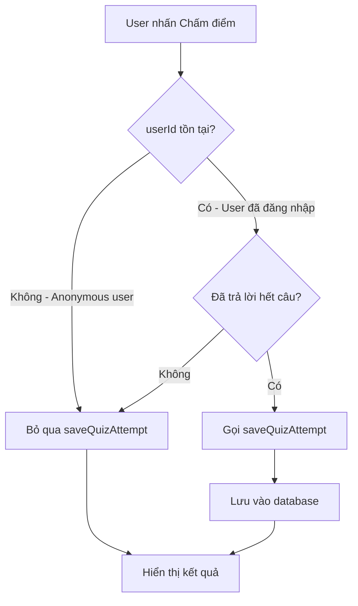

# 📋 Phân Tích: Hàm saveQuizAttempt Khi User Chưa Đăng Nhập

## 🎯 Câu Hỏi Ban Đầu

> Kiểm tra xem nếu khi user không đăng nhập mà làm quiz, chấm điểm thì hàm save quiz attempt có hoạt động không để tôi test khi chưa đăng nhập.

## 🔍 Kết Quả Phân Tích

### ❌ Kết luận: Hàm `saveQuizAttempt()` **KHÔNG hoạt động** khi user chưa đăng nhập

## 📊 Chi Tiết Phân Tích

### 1. Code Flow Hiện Tại

Trong file [`QuizContent.tsx`](src/components/quiz/QuizContent.tsx:444-485), khi user nhấn nút "Chấm điểm":

```typescript
<Button
  onClick={async () => {
    // Save quiz attempt before grading
    if (userId && answeredCount === quiz.questions.length) {
      const score = calculateScore();
      // ... tính toán các giá trị

      const saved = await saveQuizAttempt(
        quiz.id,
        userId,
        score,
        quiz.questions.length,
        correctAnswers,
        userAnswers,
        timeTaken
      );

      if (saved) {
        console.log("✅ Quiz attempt saved successfully");
      } else {
        console.log("❌ Failed to save quiz attempt");
      }
    }

    onGrade();
    scrollToTop();
  }}
```

### 2. Điều Kiện Kiểm Tra

**Dòng 446:** `if (userId && answeredCount === quiz.questions.length)`

Điều kiện này yêu cầu **CẢ HAI** điều kiện sau:

- ✅ `userId` phải tồn tại (user đã đăng nhập)
- ✅ `answeredCount === quiz.questions.length` (đã trả lời hết tất cả câu hỏi)

### 3. Trường Hợp User Chưa Đăng Nhập

Khi user **CHƯA đăng nhập**:

- `userId` = `undefined` (được truyền từ [`QuizGenerator.tsx:1599`](src/components/quiz/QuizGenerator.tsx:1599))
- Điều kiện `if (userId && ...)` trở thành `if (undefined && ...)` = `false`
- ❌ **Hàm `saveQuizAttempt()` KHÔNG BAO GIỜ được gọi**
- ❌ **KHÔNG có dữ liệu nào được lưu vào database**

### 4. Flow Chart



## ✅ Tại Sao Logic Này Là Đúng?

### Lý do thiết kế như vậy:

1. **Bảo mật database**: Anonymous users không có `user_id` hợp lệ trong bảng `auth.users`
2. **RLS Policies**: Supabase RLS policies yêu cầu `user_id` phải tồn tại
3. **Data integrity**: Tránh lưu dữ liệu rác từ anonymous users
4. **Business logic**: Khuyến khích users đăng nhập để tracking progress

### Schema Database

Table `quiz_attempts` có foreign key constraint:

```sql
user_id UUID NOT NULL REFERENCES auth.users(id)
```

Nếu cố gắng INSERT với `user_id = null` hoặc không tồn tại → **Database error**

## 🧪 Cách Test Hàm saveQuizAttempt

### Phương Án 1: Test Với User Đã Đăng Nhập (Khuyến nghị)

```bash
# Bước 1: Đăng nhập vào ứng dụng
# Bước 2: Tạo quiz
# Bước 3: Làm quiz và chấm điểm
# Bước 4: Kiểm tra console logs
```

**Console logs kỳ vọng:**

```
saveQuizAttempt called with: { quizId: "...", userId: "...", ... }
✅ Quiz attempt saved successfully
```

### Phương Án 2: Test Tạm Thời (Development Only)

**CẢNH BÁO**: Chỉ dùng để test, không deploy lên production!

Tạm thời sửa điều kiện trong [`QuizContent.tsx:446`](src/components/quiz/QuizContent.tsx:446):

```typescript
// TRƯỚC (Production):
if (userId && answeredCount === quiz.questions.length) {

// SAU (Test only - Dùng mock userId):
const testUserId = userId || "00000000-0000-0000-0000-000000000000"; // Mock UUID
if (answeredCount === quiz.questions.length) {
  await saveQuizAttempt(
    quiz.id,
    testUserId,  // Dùng mock ID để test
    // ...
  );
}
```

⚠️ **LƯU Ý**:

- Mock UUID phải tồn tại trong bảng `auth.users`
- Hoặc tạm thời disable RLS để test
- **PHẢI xóa code test trước khi commit**

### Phương Án 3: Unit Test

Tạo file test riêng để test hàm `saveQuizAttempt`:

```typescript
// src/components/quiz/__tests__/QuizContent.test.tsx
import { saveQuizAttempt } from "../QuizContent";

describe("saveQuizAttempt", () => {
  it("should save quiz attempt for authenticated user", async () => {
    const mockUserId = "valid-user-id";
    const result = await saveQuizAttempt(
      "quiz-id",
      mockUserId,
      80,
      10,
      8,
      [0, 1, 2, 0, 1, 2, 0, 1, 2, 0],
      120
    );

    expect(result).toBe(true);
  });
});
```

## 📝 Hướng Dẫn Test Chi Tiết

### Test Scenario 1: User Đã Đăng Nhập

**Các bước:**

1. ✅ Đăng nhập vào ứng dụng (Google OAuth)
2. ✅ Tạo một quiz với chủ đề bất kỳ
3. ✅ Trả lời tất cả câu hỏi
4. ✅ Nhấn "Chấm điểm"
5. ✅ Mở DevTools Console (F12)
6. ✅ Kiểm tra logs:

```
saveQuizAttempt called with: {
  quizId: "abc-123",
  userId: "user-uuid-here",
  score: 8,
  totalQuestions: 10,
  correctAnswers: 8,
  userAnswers: [...],
  timeTaken: 145
}
✅ Quiz attempt saved successfully
Quiz attempt saved: [...]
```

7. ✅ Kiểm tra Supabase Table Editor:
   - Vào bảng `quiz_attempts`
   - Tìm record mới với `user_id` của bạn
   - Verify các fields: `score`, `total_questions`, `correct_answers`, `completed_at`

### Test Scenario 2: User Chưa Đăng Nhập

**Các bước:**

1. ❌ Đảm bảo CHƯA đăng nhập (Sign Out)
2. ✅ Tạo quiz (anonymous user vẫn có thể tạo quiz)
3. ✅ Trả lời tất cả câu hỏi
4. ✅ Nhấn "Chấm điểm"
5. ✅ Mở DevTools Console (F12)
6. ✅ Kiểm tra logs:

```
# KHÔNG có log nào từ saveQuizAttempt
# Chỉ thấy log từ onGrade()
```

7. ✅ Kiểm tra Supabase Table Editor:
   - Vào bảng `quiz_attempts`
   - ❌ **KHÔNG có record mới nào được tạo**

## 🎯 Kết Luận & Khuyến Nghị

### Kết Luận

| Trạng thái User   | saveQuizAttempt được gọi? | Dữ liệu được lưu? |
| ----------------- | ------------------------- | ----------------- |
| ✅ Đã đăng nhập   | ✅ Có                     | ✅ Có             |
| ❌ Chưa đăng nhập | ❌ Không                  | ❌ Không          |

### Khuyến Nghị Test

1. **Test chính thức**: Đăng nhập và test như user bình thường
2. **Test code**: Viết unit tests cho hàm `saveQuizAttempt`
3. **Test database**: Verify RLS policies hoạt động đúng
4. **Test UI**: Kiểm tra Dashboard cập nhật sau khi làm quiz

### Nếu Cần Support Anonymous Users

Nếu trong tương lai muốn lưu quiz attempts cho anonymous users, có thể:

1. **Tạo bảng riêng** `anonymous_quiz_attempts` (không require user_id)
2. **Dùng session tracking** (localStorage UUID)
3. **Prompt đăng nhập** sau khi làm xong quiz
4. **Migrate data** từ anonymous sang authenticated khi user đăng nhập

## 📞 Liên Hệ

Nếu cần hỗ trợ thêm về testing hoặc muốn implement anonymous user tracking, hãy cho tôi biết!
