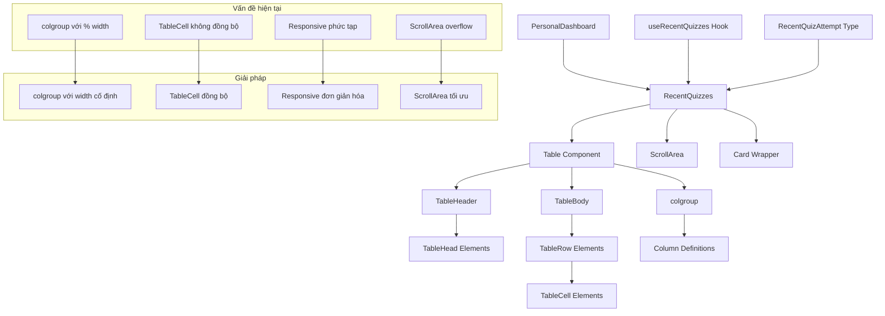
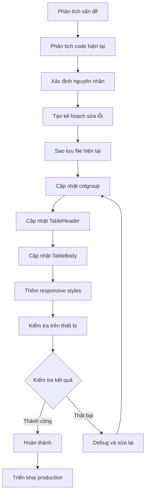
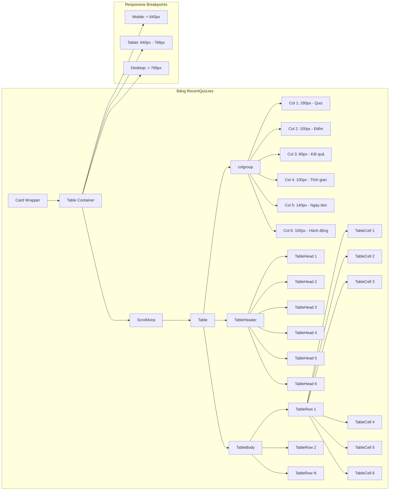
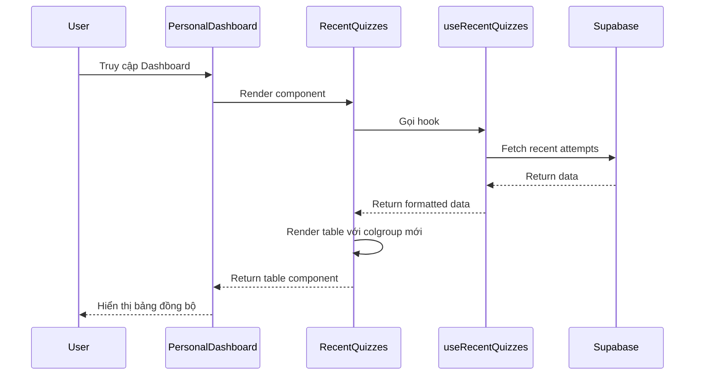

# Sơ đồ luồng sửa lỗi bảng RecentQuizzes

## Sơ đồ kiến trúc component

```mermaid
graph TD
    A[PersonalDashboard] --> B[RecentQuizzes]
    B --> C[Table Component]
    B --> D[ScrollArea]
    B --> E[Card Wrapper]

    C --> F[TableHeader]
    C --> G[TableBody]
    C --> H[colgroup]

    F --> I[TableHead Elements]
    G --> J[TableRow Elements]
    J --> K[TableCell Elements]

    H --> L[Column Definitions]

    M[useRecentQuizzes Hook] --> B
    N[RecentQuizAttempt Type] --> B

    subgraph "Vấn đề hiện tại"
        O[colgroup với % width]
        P[TableCell không đồng bộ]
        Q[Responsive phức tạp]
        R[ScrollArea overflow]
    end

    subgraph "Giải pháp"
        S[colgroup với width cố định]
        T[TableCell đồng bộ]
        U[Responsive đơn giản hóa]
        V[ScrollArea tối ưu]
    end

    O --> S
    P --> T
    Q --> U
    R --> V
```

## Sơ đồ luồng sửa lỗi

```mermaid
flowchart TD
    Start[Phân tích vấn đề] --> Analyze[Phân tích code hiện tại]
    Analyze --> Identify[Xác định nguyên nhân]
    Identify --> Plan[Tạo kế hoạch sửa lỗi]

    Plan --> Backup[Sao lưu file hiện tại]
    Backup --> Colgroup[Cập nhật colgroup]
    Colgroup --> Header[Cập nhật TableHeader]
    Header --> Body[Cập nhật TableBody]
    Body --> Responsive[Thêm responsive styles]
    Responsive --> Test[Kiểm tra trên thiết bị]

    Test --> Check{Kiểm tra kết quả}
    Check -->|Thành công| Success[Hoàn thành]
    Check -->|Thất bại| Debug[Debug và sửa lại]
    Debug --> Colgroup

    Success --> Deploy[Triển khai production]
```

## Sơ đồ cấu trúc bảng sau khi sửa

```mermaid
graph LR
    subgraph "Bảng RecentQuizzes"
        A[Card Wrapper] --> B[Table Container]
        B --> C[ScrollArea]
        C --> D[Table]

        D --> E[colgroup]
        D --> F[TableHeader]
        D --> G[TableBody]

        E --> H[Col 1: 280px - Quiz]
        E --> I[Col 2: 100px - Điểm]
        E --> J[Col 3: 80px - Kết quả]
        E --> K[Col 4: 100px - Thời gian]
        E --> L[Col 5: 140px - Ngày làm]
        E --> M[Col 6: 100px - Hành động]

        F --> N[TableHead 1]
        F --> O[TableHead 2]
        F --> P[TableHead 3]
        F --> Q[TableHead 4]
        F --> R[TableHead 5]
        F --> S[TableHead 6]

        G --> T[TableRow 1]
        G --> U[TableRow 2]
        G --> V[TableRow N]

        T --> W[TableCell 1]
        T --> X[TableCell 2]
        T --> Y[TableCell 3]
        T --> Z[TableCell 4]
        T --> AA[TableCell 5]
        T --> BB[TableCell 6]
    end

    subgraph "Responsive Breakpoints"
        CC[Mobile: < 640px]
        DD[Tablet: 640px - 768px]
        EE[Desktop: > 768px]
    end

    B --> CC
    B --> DD
    B --> EE
```

## Sơ đồ luồng dữ liệu

```mermaid
sequenceDiagram
    participant U as User
    participant PD as PersonalDashboard
    participant RQ as RecentQuizzes
    participant URQ as useRecentQuizzes
    participant SB as Supabase

    U->>PD: Truy cập Dashboard
    PD->>RQ: Render component
    RQ->>URQ: Gọi hook
    URQ->>SB: Fetch recent attempts
    SB-->>URQ: Return data
    URQ-->>RQ: Return formatted data
    RQ->>RQ: Render table với colgroup mới
    RQ-->>PD: Return table component
    PD-->>U: Hiển thị bảng đồng bộ
```
