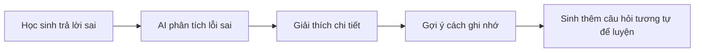

# 📚 QUIZKEN - Nền Tảng Ôn Luyện Thông Minh Bằng AI

> *"Biến mọi ý tưởng thành bài kiểm tra chất lượng chỉ trong vài giây"*

---

## 1️⃣ Mục Tiêu Sản Phẩm

### Tuyên Ngôn Sứ Mệnh
**Quizken** ra đời với mục tiêu **bình dân hóa công nghệ ôn tập** - giúp bất kỳ ai, từ học sinh THPT đến giáo viên dày dặn kinh nghiệm, đều có thể tạo ra bộ câu hỏi trắc nghiệm chuẩn chỉnh mà không cần kỹ năng chuyên môn hay tốn hàng giờ biên soạn.

### Bài Toán Chúng Tôi Giải Quyết

| Vấn đề | Giải pháp Quizken |
|--------|-------------------|
| Soạn đề thi mất 2-3 tiếng | Tạo đề tự động trong **30 giây** |
| Không có tài liệu ôn tập chất lượng | AI tạo câu hỏi theo chuẩn Bloom's Taxonomy |
| Học sinh thiếu động lực ôn bài | Gamification biến học thành chơi |
| Giáo viên vùng sâu thiếu nguồn tài liệu | Platform miễn phí, chỉ cần internet |

### Mục Tiêu Cụ Thể
- ✅ Giảm **90% thời gian** soạn đề cho giáo viên
- ✅ Tăng **70% tỷ lệ duy trì** thói quen học tập nhờ gamification
- ✅ Phục vụ **mọi môn học, mọi ngôn ngữ** (đặc biệt tối ưu cho tiếng Việt)

---

## 2️⃣ Tính Năng Chính

### 🎯 Core Feature: AI Quiz Generator
```
[Nhập chủ đề] → [AI phân tích] → [Sinh câu hỏi] → [Xuất PDF/Chia sẻ link]
```

**Ví dụ thực tế:**
- Input: *"Lịch sử Việt Nam thế kỷ 19"*
- Output: 20 câu trắc nghiệm với 4 mức độ: Nhận biết → Thông hiểu → Vận dụng → Vận dụng cao

### 🎮 English Hub - Học Tiếng Anh Như Chơi Game

| Tính năng | Mô tả | Lợi ích |
|-----------|-------|---------|
| **Learning Map** | Bản đồ học tập dạng RPG với các "vùng đất" kiến thức | Trực quan hóa tiến trình, tạo cảm giác chinh phục |
| **Daily Streak** | Hệ thống chuỗi ngày học liên tục | Xây dựng thói quen, tăng motivation |
| **Personal Notebook** | Sổ tay tự động lưu từ vựng mới | Ôn tập spaced repetition, không quên kiến thức |
| **Pronunciation Practice** | Luyện phát âm với Text-to-Speech | Cải thiện speaking, listening |

### 📤 Công Cụ Tiện Ích
- **Export PDF**: Xuất đề thi chuẩn định dạng, hỗ trợ tiếng Việt hoàn hảo (Unicode)
- **Share Link**: Mỗi bộ đề có URL riêng → Chia sẻ 1 click qua Zalo, Facebook, Email
- **Real-time Progress**: Theo dõi tiến trình tạo đề theo thời gian thực

---

## 3️⃣ Ý Tưởng Ứng Dụng AI

### 🤖 Hiện Tại: AI-Powered Quiz Generation
- **Gemini API Integration**: Sử dụng LLM để phân tích chủ đề và sinh câu hỏi chất lượng
- **Smart Caching**: Tối ưu chi phí API bằng cách lưu cache các bộ đề phổ biến
- **Content Filtering**: AI lọc nội dung không phù hợp, đảm bảo an toàn cho học sinh

### 🚀 Tương Lai: Roadmap AI

#### Phase 1: AI Tutor (Gia Sư Ảo)


#### Phase 2: Adaptive Learning (Học Thích Ứng)
- **Phát hiện điểm yếu**: AI nhận biết chủ đề học sinh hay sai
- **Điều chỉnh độ khó**: Tự động tăng/giảm level phù hợp năng lực
- **Personalized Pathway**: Mỗi người một lộ trình học riêng

#### Phase 3: AI Visual Content
- **Auto Illustrations**: Tự động tạo hình minh họa cho câu hỏi
- **Mind Map Generator**: Sinh sơ đồ tư duy từ chủ đề
- **Video Explainer**: AI tạo video giải thích ngắn

#### Phase 4: AI for UI/UX
- **Smart Search**: Tìm kiếm ngữ nghĩa, hiểu ý định người dùng
- **Predictive UI**: Gợi ý chủ đề dựa trên lịch sử học tập
- **Accessibility AI**: Tự động điều chỉnh giao diện phù hợp với người dùng đặc biệt

---

## 4️⃣ Giao Diện Dự Kiến (UI/UX)

### 🎨 Triết Lý Thiết Kế

> **"Focus First, Joy Always"** - Tập trung tối đa, niềm vui luôn hiện hữu

### Design System

#### Color Palette
| Mục đích | Màu sắc | Hex Code |
|----------|---------|----------|
| Primary | Deep Indigo | `#6366F1` |
| Secondary | Vibrant Violet | `#8B5CF6` |
| Accent | Energetic Coral | `#F97316` |
| Success | Fresh Green | `#22C55E` |
| Background | Soft Gradient | `#F8FAFC → #EEF2FF` |

#### Typography
- **Headings**: Inter (Bold, Medium) - Hiện đại, dễ đọc
- **Body**: Inter (Regular) - Thân thiện, chuyên nghiệp
- **Vietnamese Support**: Unicode hoàn hảo, không lỗi font

### 🖼️ Các Màn Hình Chính

#### 1. Landing Page - Hero Section
```
┌─────────────────────────────────────────────────────────────┐
│  ┌─────┐                              [Đăng nhập] [Bắt đầu] │
│  │LOGO │  Quizken                                           │
│  └─────┘                                                    │
├─────────────────────────────────────────────────────────────┤
│                                                             │
│     ✨ BIẾN Ý TƯỞNG THÀNH BÀI KIỂM TRA                     │
│        CHẤT LƯỢNG CHỈ TRONG 30 GIÂY                        │
│                                                             │
│   ┌─────────────────────────────────────────────────────┐   │
│   │  🔍 Nhập chủ đề bất kỳ... (VD: "Toán lớp 10")      │   │
│   └─────────────────────────────────────────────────────┘   │
│                                                             │
│              [ 🚀 TẠO ĐỀ NGAY - MIỄN PHÍ ]                 │
│                                                             │
│        📊 10,000+ đề đã tạo  |  ⭐ 4.9/5 đánh giá          │
│                                                             │
└─────────────────────────────────────────────────────────────┘
```

**Đặc điểm UI:**
- Hero text lớn, gradient animated
- Input field nổi bật, có placeholder gợi ý
- CTA button với hiệu ứng hover và micro-animation
- Social proof stats với count-up animation

#### 2. Quiz Creation - Real-time Progress
```
┌─────────────────────────────────────────────────────────────┐
│  ← Quay lại                    Tạo bài kiểm tra mới        │
├─────────────────────────────────────────────────────────────┤
│                                                             │
│   Chủ đề: "Lịch sử Việt Nam thế kỷ 19"                     │
│                                                             │
│   ┌─────────────────────────────────────────┐               │
│   │ ████████████░░░░░░░░░  60%              │               │
│   │ Đang tạo câu hỏi 12/20...               │               │
│   └─────────────────────────────────────────┘               │
│                                                             │
│   ✅ Câu 1: Ai là người lãnh đạo phong trào...             │
│   ✅ Câu 2: Sự kiện nào đánh dấu...                         │
│   ⏳ Câu 12: Đang sinh câu hỏi...                           │
│                                                             │
│   💡 Mẹo: Bạn có thể xem trước câu hỏi trong khi chờ đợi   │
│                                                             │
└─────────────────────────────────────────────────────────────┘
```

**Đặc điểm UI:**
- Progress bar animated, smooth transition
- Real-time streaming hiển thị từng câu hỏi
- Skeleton loading cho câu hỏi đang tạo
- Tip contextual giữ người dùng engaged

#### 3. Quiz Taking - Gamified Experience
```
┌─────────────────────────────────────────────────────────────┐
│  📊 Câu 5/20    ⏱️ 02:30    🎯 80 điểm    🔥 Streak: 3    │
├─────────────────────────────────────────────────────────────┤
│                                                             │
│   ┌─────────────────────────────────────────────────────┐   │
│   │  📝 Câu hỏi:                                        │   │
│   │                                                     │   │
│   │  Ai là người sáng lập phong trào Đông Du?          │   │
│   │                                                     │   │
│   └─────────────────────────────────────────────────────┘   │
│                                                             │
│   ┌─────────────────────┐  ┌─────────────────────┐         │
│   │ A. Phan Bội Châu    │  │ B. Phan Châu Trinh  │         │
│   └─────────────────────┘  └─────────────────────┘         │
│                                                             │
│   ┌─────────────────────┐  ┌─────────────────────┐         │
│   │ C. Nguyễn Thái Học  │  │ D. Huỳnh Thúc Kháng│         │
│   └─────────────────────┘  └─────────────────────┘         │
│                                                             │
│        [Câu trước]              [Câu tiếp theo →]          │
│                                                             │
└─────────────────────────────────────────────────────────────┘
```

**Đặc điểm UI:**
- Header sticky với thông tin quan trọng
- Answer cards với hover effect và ripple animation
- Progress indicator trực quan
- Sound effects khi trả lời đúng/sai (có thể tắt)
- Streak counter tạo động lực

#### 4. English Hub - Learning Map
```
┌─────────────────────────────────────────────────────────────┐
│  🏠 English Hub    🔥 15-day streak    📚 Level 5          │
├─────────────────────────────────────────────────────────────┤
│                                                             │
│        🌟 ← Bạn đang ở đây                                 │
│         │                                                   │
│    ┌────┴────┐                                             │
│    │ Grammar │ ████████ 80%                                │
│    │ Basics  │                                             │
│    └────┬────┘                                             │
│         │                                                   │
│    ┌────┴────┐    ┌─────────┐                              │
│    │  Vocab  │────│ Reading │ (Locked 🔒)                  │
│    │  Food   │    │ Skills  │                              │
│    └────┬────┘    └─────────┘                              │
│         │                                                   │
│    ┌────┴────┐                                             │
│    │ Listening│ (Coming soon ⏳)                           │
│    │ Practice │                                             │
│    └─────────┘                                             │
│                                                             │
│   ┌─────────────────────────────────────────────────────┐   │
│   │ 📖 Sổ tay: 145 từ vựng | 📊 Today: 30 XP earned    │   │
│   └─────────────────────────────────────────────────────┘   │
│                                                             │
└─────────────────────────────────────────────────────────────┘
```

**Đặc điểm UI:**
- Visual learning path như game RPG
- Progress indicators cho từng "vùng đất"
- Locked content với preview để tạo curiosity
- Stats bar ở footer với achievements

#### 5. Dashboard - Personal Analytics
```
┌─────────────────────────────────────────────────────────────┐
│  👤 Xin chào, Nguyễn Văn A!         [Settings] [Logout]    │
├─────────────────────────────────────────────────────────────┤
│                                                             │
│   ┌──────────┐  ┌──────────┐  ┌──────────┐  ┌──────────┐   │
│   │   23     │  │   89%    │  │   15     │  │   156    │   │
│   │ Bài đã   │  │ Điểm     │  │ Day      │  │ Từ vựng  │   │
│   │ hoàn thành│ │ trung bình│ │ Streak   │  │ đã học   │   │
│   └──────────┘  └──────────┘  └──────────┘  └──────────┘   │
│                                                             │
│   📈 Tiến trình học tập (7 ngày gần nhất)                  │
│   ┌─────────────────────────────────────────────────────┐   │
│   │     ▄▄    ▄▄                    ▄▄                  │   │
│   │  ▄▄ ██ ▄▄ ██    ▄▄    ██    ▄▄ ██    ▄▄           │   │
│   │  ██ ██ ██ ██ ▄▄ ██ ▄▄ ██ ▄▄ ██ ██ ▄▄ ██           │   │
│   │  T2 T3 T4 T5 T6 T7 CN                              │   │
│   └─────────────────────────────────────────────────────┘   │
│                                                             │
│   📚 Bài kiểm tra gần đây                                  │
│   ┌─────────────────────────────────────────────────────┐   │
│   │ • Toán lớp 10 - Chương 2        ⭐ 95%  |  Hôm qua │   │
│   │ • Tiếng Anh - Grammar           ⭐ 87%  |  2 ngày  │   │
│   │ • Lịch sử - WWII                ⭐ 78%  |  3 ngày  │   │
│   └─────────────────────────────────────────────────────┘   │
│                                                             │
└─────────────────────────────────────────────────────────────┘
```

**Đặc điểm UI:**
- Stats cards với count-up animation (GSAP)
- Interactive chart có thể click để xem chi tiết
- Recent quizzes với quick actions
- Personalized greeting dựa trên thời gian

### 📱 Responsive Design

| Breakpoint | Layout | Đặc điểm |
|------------|--------|----------|
| Mobile (< 640px) | Single column | Bottom navigation, touch-optimized buttons |
| Tablet (640-1024px) | 2 columns | Side navigation, larger touch targets |
| Desktop (> 1024px) | Multi-column | Full navigation, hover effects |

### ✨ Micro-interactions & Animations
- **Button hover**: Scale up + shadow elevation
- **Card hover**: Subtle lift + border glow
- **Page transition**: Smooth fade + slide
- **Loading states**: Skeleton screens + smooth spinners
- **Success feedback**: Confetti animation khi hoàn thành bài
- **Streak**: Fire animation với particle effects

### 🎯 Accessibility (WCAG 2.1)
- Contrast ratio ≥ 4.5:1 cho text
- Keyboard navigation đầy đủ
- Screen reader compatible
- Reduced motion option cho người nhạy cảm

---

## 5️⃣ Đối Tượng Người Dùng

### 🎓 Primary Users

#### Học sinh / Sinh viên
- **Nhu cầu**: Ôn tập hiệu quả trước kỳ thi
- **Pain point**: Không có đủ bài tập để luyện, thiếu feedback
- **Giải pháp**: AI tạo đề không giới hạn, instant feedback

#### Giáo viên / Gia sư
- **Nhu cầu**: Tạo bài kiểm tra nhanh, đa dạng
- **Pain point**: Mất hàng giờ soạn đề, nguồn tài liệu hạn chế
- **Giải pháp**: 30 giây có đề, xuất PDF chuyên nghiệp

### 👥 Secondary Users

#### Người đi làm
- **Nhu cầu**: Học kỹ năng mới, ngoại ngữ
- **Pain point**: Ít thời gian, cần hiệu quả cao
- **Giải pháp**: Micro-learning 5-10 phút, học mọi lúc mọi nơi

#### Phụ huynh
- **Nhu cầu**: Kèm con học tại nhà
- **Pain point**: Không biết soạn đề, không chắc chất lượng
- **Giải pháp**: AI đảm bảo chất lượng, theo dõi tiến trình con

### 📊 User Persona

| Persona | Tuổi | Mục tiêu | Tần suất sử dụng |
|---------|------|----------|------------------|
| Học sinh THPT | 15-18 | Ôn thi đại học | Hàng ngày |
| Sinh viên | 18-24 | Ôn thi, học tiếng Anh | 3-4 lần/tuần |
| Giáo viên | 25-55 | Tạo đề kiểm tra | 2-3 lần/tuần |
| Người đi làm | 22-40 | Upskill, ngoại ngữ | 2-3 lần/tuần |

---

## 6️⃣ Tác Động Xã Hội & Giá Trị Mang Lại

### 🌍 Tầm Nhìn Xã Hội

> **"Mọi học sinh Việt Nam đều xứng đáng có công cụ học tập chất lượng cao"**

### 📈 Tác Động Định Lượng

| Chỉ số | Hiện trạng | Với Quizken | Tác động |
|--------|------------|-------------|----------|
| Thời gian soạn đề/GV | 2-3 giờ/tuần | 10 phút/tuần | **Tiết kiệm 100+ giờ/năm** |
| Chi phí ôn luyện/HS | 500k-2tr/tháng | 0đ (free tier) | **Tiết kiệm 6-24tr/năm** |
| Tỷ lệ duy trì học tập | ~20% sau 1 tháng | ~70% với gamification | **Tăng 3.5x** |

### 💡 Giá Trị Cốt Lõi

#### 1. Công Bằng Giáo Dục
- **Giáo dục miễn phí**: Tài liệu chất lượng không phụ thuộc khả năng tài chính
- **Đa dạng hóa nguồn học**: Không phụ thuộc vào một bộ sách hay giáo viên cụ thể

#### 2. Giải Phóng Lao Động Tri Thức
- **Giáo viên**: Thay vì soạn đề, tập trung vào giảng dạy và hỗ trợ học sinh
- **Phụ huynh**: Không cần lo lắng về chất lượng bài tập tự tạo
- **Học sinh**: Active recall hiệu quả hơn đọc sách thụ động

#### 3. Thay Đổi Tư Duy Học Tập
- **Từ "học vẹt" → "hiểu sâu"**: AI tạo câu hỏi vận dụng, không chỉ ghi nhớ
- **Từ "áp lực" → "niềm vui"**: Gamification biến kiểm tra thành game
- **Từ "thụ động" → "chủ động"**: Học sinh tự tạo đề, tự kiểm tra

### 🎯 Sustainable Development Goals (SDGs)

| SDG | Đóng góp của Quizken |
|-----|----------------------|
| **SDG 4: Quality Education** | Cung cấp công cụ học tập miễn phí, chất lượng cao |
| **SDG 10: Reduced Inequalities** | Xóa bỏ bất bình đẳng trong tiếp cận giáo dục |
| **SDG 8: Decent Work** | Tăng năng suất cho giáo viên, tiết kiệm thời gian |

### 🌟 Testimonials (Dự kiến)

> *"Trước đây tôi mất 3 tiếng để soạn một bài kiểm tra 15 phút. Giờ chỉ cần 30 giây. Thời gian tiết kiệm được tôi dành để giải đáp thắc mắc của học sinh."*
> — Cô Nguyễn Thị B, Giáo viên Toán, Hà Nội

> *"Em học ở vùng núi, không có điều kiện đi học thêm. Quizken giúp em tự ôn thi hiệu quả và đỗ đại học."*
> — Em Trần Văn C, Học sinh lớp 12, Lào Cai

---

## 📎 Phụ Lục

### Tech Stack
- **Frontend**: React + TypeScript + TailwindCSS
- **Backend**: Supabase (Postgres + Auth + Storage)
- **AI**: Google Gemini API
- **Deployment**: Vercel

### Links
- 🌐 **Website**: [quizken.io](https://quizken.io)
- 📱 **GitHub**: [github.com/quizken](https://github.com/quizken)

---

*Cập nhật lần cuối: Tháng 01/2026*
